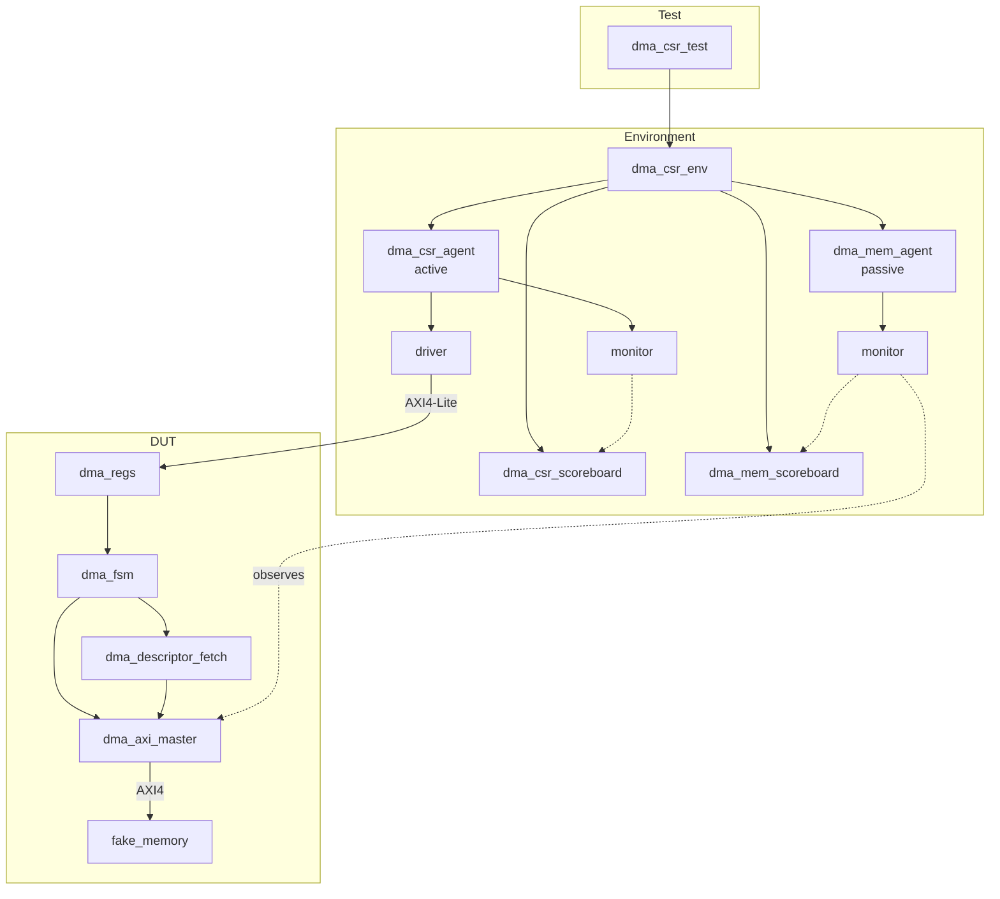

# DMA Controller — Verification Plan & Design Review
 
**Project:** Single-channel scatter-gather DMA controller (AXI4-Lite CSR interface + AXI4 memory interface), SystemVerilog RTL with a UVM verification environment.
 
---
 
## 1. Requirements → Verification Mapping
 
| Requirement | How it's verified | Status |
|---|---|---|
| CPU can configure the DMA via AXI4-Lite (control, status, descriptor pointer registers) | `dma_csr_scoreboard` — write-then-read-back check on `DESC_PTR_L`/`DESC_PTR_H` | ✅ Passing |
| DMA correctly fetches a 32-byte descriptor over 4 AXI4 beats | Decoded `xfer_length`/addresses observed correctly downstream; unpacking logic exercised every run | ✅ Passing (indirect) |
| Data read from the source address is written correctly to the destination address | `dma_mem_scoreboard` — independent read-then-write comparison on the real AXI4 memory bus | ✅ Passing |
| Scatter-gather chain correctly terminates on a null next-descriptor pointer | FSM's `dma_check_next` → `dma_idle` transition, confirmed via signal-level trace in `tb_csr_top` | ✅ Passing (single-descriptor case only) |
| CPU can poll `DMA_STATUS` to detect completion | `read_status_seq`, polled in `dma_csr_test::run_phase` until `busy` clears | ✅ Passing |
 
---
 
## 2. Architecture
 

 
---
 
## 3. Scope Decisions (v1)
 
Deliberately out of scope, to keep v1 achievable and fully testable:
 
- **Multi-channel support** — would need per-channel buffering and real arbitration in the AXI4 master; v1 is single-channel by design.
- **Interrupt-driven completion** — v1 uses CPU polling of `DMA_STATUS` only.
- **Error recovery beyond detection** — a detected error halts the FSM; no retry/recovery logic.
- **Partial-beat / unaligned transfers** — v1 assumes transfer lengths are exact multiples of 8 bytes.
- **Explicit EOF descriptor bit** — chain termination relies solely on a null next-descriptor pointer.
- **AXI response-code (BRESP/RRESP) checking** — the AXI master currently trusts every completed handshake; no SLVERR handling.
Each of these was a deliberate call, not an oversight — documented as it was made, not reconstructed after the fact (see the project's bug/decision tracker).
 
---
 
## 4. Residual Risks / Not Yet Covered
 
Honest gaps, not claimed as done:
 
- **No constrained-random or directed edge-case tests yet** — current coverage is one directed scenario (single descriptor, 8-byte transfer). Variable transfer sizes, max-length transfers, and multi-descriptor chains are unverified.
- **No error-injection testing** — bus-error/SLVERR behavior during descriptor fetch or data movement is unverified, consistent with the RTL not yet handling it.
- **No back-to-back / multi-descriptor chain test** — the scatter-gather loop-back logic is implemented and was verified at the RTL sanity stage, but not yet exercised through the UVM environment.
- **Functional coverage is minimal** — one covergroup on CSR register access (see below); no coverage yet on transfer sizes, address ranges, or error paths.
- **Code coverage has not been measured** — no formal line/branch/toggle coverage run yet.
- **RAL not used** — register tracking is currently manual (plain variables in the scoreboard), not a `uvm_reg` model.
- **SVA not used** — no protocol-level assertions bound to the interfaces yet; correctness is currently checked only at the transaction level.
---
 
## 5. Next Steps (priority order)
 
1. Multi-descriptor chain test (exercises the actual scatter-gather loop, not just single-transfer)
2. Constrained-random transfer-length sequences
3. Functional coverage on transfer size and address range
4. Error-injection test once RTL error handling is added
5. RAL migration for register tracking
6. SVA protocol assertions on both interfaces
---
 
## 6. Summary
 
The RTL was hand-designed and validated first with a directed, self-checking testbench, then re-verified through a full UVM environment covering both the CSR configuration path and the AXI4 memory-movement path, with two independent scoreboards. Every bug encountered — RTL and testbench — is logged with root cause and fix in the project's bug tracker. This is a complete, working v1 for a defined, deliberately bounded scope; the gaps above are the honest next steps, not hidden limitations.
 
